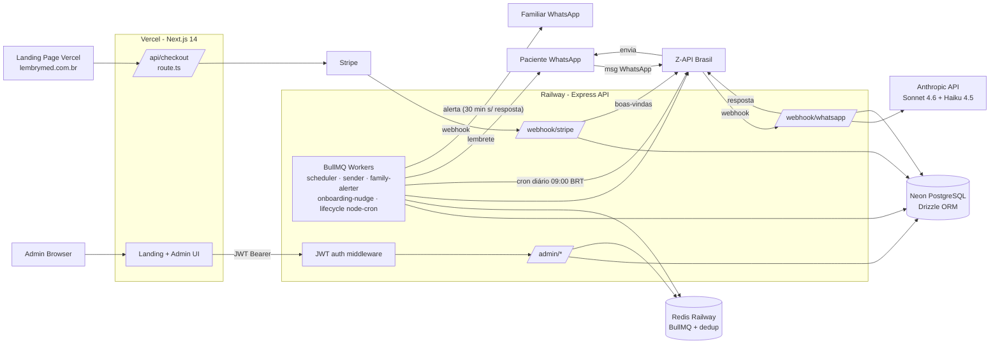

# Onda 1 — Reconhecimento e Mapeamento

**Auditoria forense LEMBRYMED — executada em 22/04/2026**

---

## Seção A — Stack Real Descoberta (esperado vs. encontrado)

| Camada                 | Esperado (prompt/documentação)          | **Encontrado no código (fonte de verdade)**                          | Divergência? |
|------------------------|------------------------------------------|-----------------------------------------------------------------------|--------------|
| Monorepo               | Turborepo (implícito)                    | **Turborepo** 2.0 + npm workspaces (`apps/*`, `packages/*`)           | ✅ não       |
| Frontend/Hosting       | Vercel + Next.js 14 App Router           | **Next.js 14.2 App Router** (apps/web), deploy Vercel                 | ✅ não       |
| Banco de dados         | Neon PostgreSQL serverless               | **Neon** via `@neondatabase/serverless` + **Drizzle ORM** 0.31        | ✅ não       |
| Backend/APIs/Workers   | Railway                                  | **Express 4.19** em Railway, Dockerfile bundla via esbuild            | ✅ não       |
| Fila / Jobs assíncronos | (não detalhado)                         | **BullMQ 5.8 + ioredis** (Redis Railway) + **node-cron** p/ lifecycle | ⚠️ nova info |
| Automação/Orquestração | n8n                                      | **NÃO EXISTE** — nunca foi integrado; tudo em BullMQ + node-cron      | ⚠️ divergência |
| WhatsApp (oficial atual) | Z-API                                  | **Z-API** (cliente em `dialog360.client.ts`) via `WHATSAPP_PROVIDER=zapi` | ✅ não   |
| WhatsApp (legacy suportado) | —                                    | **360dialog, Meta Cloud, Twilio** também implementados (fallback)     | ⚠️ dead code talvez |
| IA                     | Claude Sonnet + Haiku                    | **Claude Sonnet 4.6** (conversação) + **Haiku 4.5** (extração JSON)   | ✅ não       |
| Arquitetura onboarding | Managed Agents (README)                  | **Claude `messages.create` direto** — Managed Agents descontinuado    | ⚠️ doc desatualizada |
| Email                  | Resend                                   | **NÃO EXISTE** — nenhum envio transacional por email no código        | ⚠️ divergência |
| Pagamentos             | (não declarado no prompt)                | **Stripe 15** (checkout + webhook)                                     | ⚠️ nova info |
| Autenticação (admin)   | ? (descobrir)                            | **JWT caseiro** (jsonwebtoken + bcryptjs), single-admin por env        | ⚠️ nova info |
| Autenticação (paciente) | ? (descobrir)                           | **NÃO EXISTE** — paciente não tem login; acesso 100% via WhatsApp      | ⚠️ decisão arq. |
| ORM                    | Drizzle ou Prisma                        | **Drizzle 0.31** + drizzle-kit 0.22 (migrations em `packages/database/migrations/`) | ✅ não |
| Storage de arquivos    | ?                                        | **NÃO EXISTE** — nenhum upload persistido; imagens da Z-API só lidas   | ⚠️ gap       |
| SMS fallback           | ?                                        | **NÃO EXISTE**                                                         | ⚠️ gap crítico |
| Validação de input     | Zod                                      | **Zod 3.23** presente em deps, **porém usado apenas em `env.ts`**      | ⚠️ subutilizado |
| Observabilidade        | Sentry + Railway logs + Vercel Analytics | **Apenas Winston console.log** — Sentry **NÃO instalado**             | ⚠️ gap crítico |
| Testes                 | (não declarado)                          | **NENHUM** — zero testes automatizados, nenhum framework instalado    | ⚠️ gap crítico |
| Lint / Formatter       | (não declarado)                          | **turbo lint configurado, mas nenhum ESLint/Prettier no código**      | ⚠️ gap       |
| Headers de segurança   | Esperado: CSP/HSTS/etc                   | **NÃO EXISTE** — nenhum header configurado em next.config.js / Express | ⚠️ gap crítico |
| Rate limit             | Esperado                                 | **NÃO EXISTE** em nenhum endpoint                                     | ⚠️ gap crítico |
| LGPD (consentimento)   | Esperado                                 | **NÃO EXISTE** — nenhuma tela de consentimento                        | ⚠️ gap crítico |
| Audit log              | Esperado                                 | `message_logs`, `reminder_logs`, `family_alert_logs` existem. **Não há audit log de acesso admin a dados de paciente.** | ⚠️ parcial |

**Resumo:** A stack declarada no prompt está em geral correta. Divergências importantes:

1. **n8n, Resend, Sentry, SMS, Storage, Testes, Lint, Headers, Rate-limit, LGPD UI, audit admin — nada disso existe ainda.**
2. A documentação (`README.md`, `.env.example`, `COPILOT_AUDIT_REPORT.md`, `docs/LEMBRYMED_MANAGED_AGENTS_ADDENDUM_v1.md`) está parcialmente desatualizada — menciona Managed Agents, mas a v2.x migrou para `messages.create` direto (arquivo de legacy em `apps/api/src/_legacy/` confirma).
3. `scripts/setup-agents.ts` **está quebrado** — importa `../apps/api/src/prompts/onboarding.prompt` que não existe (foi movido para `_legacy`).
4. Código multi-provider WhatsApp (`360dialog`, `meta`, `twilio`) existe como fallback, mas só **Z-API** está em uso real conforme commits recentes.

---

## Seção B — Arquitetura

### Diagrama de Fluxo

**Pontos-chave da arquitetura:**

- **Paciente NÃO tem UI** — toda interação é via WhatsApp. Consequência: o risco clássico de **IDOR entre pacientes em endpoints web** é **reduzido** (pacientes não autenticam no web), mas surgem riscos equivalentes no canal WhatsApp: **spoofing de telefone** (ver 2.2) e no canal admin (único admin, mas qualquer um com URL + tentativa de bruteforce).
- **Railway é a autoridade canônica**: webhooks, lógica de negócio, workers e API admin moram aqui. Vercel é apenas UI + rota de checkout que fala com Stripe.
- **Neon**: conexão via HTTP serverless (`drizzle-orm/neon-http`) — **não persiste pool nativo**. Cold start ~100-400 ms por request. Para workers BullMQ que rodam em Railway (VM persistente), ideal seria usar `drizzle-orm/neon-serverless` com pooling — mas isso é otimização, não bug.
- **Redis Railway** é usado tanto para BullMQ quanto para **dedup de webhook Z-API** (Fix #5 — chaves `lembrymed:webhook:dedup:*` TTL 5 min).

---

## Seção C — Inventário Detalhado

### C.1 — Rotas Next.js (apps/web)

| Rota                                  | Tipo          | Auth | Observação                                                     |
|---------------------------------------|---------------|------|----------------------------------------------------------------|
| `/`                                   | page          | ❌   | Landing page (LembrymedLanding component)                      |
| `/checkout`                           | page          | ❌   | Form alternativa (basicamente duplicada do modal da landing)  |
| `/success`                            | page          | ❌   | Pós-Stripe                                                     |
| `/api/checkout`                       | route handler | ❌   | **POST** — cria sessão Stripe checkout                         |
| `/admin` (layout)                     | client page   | 🔒   | Protegido por JWT client-side (localStorage `lembrymed_token`) |
| `/admin` (dashboard)                  | page          | 🔒   | KPIs                                                           |
| `/admin/patients`                     | page          | 🔒   | Lista pacientes                                                |
| `/admin/patient/[phone]`              | page          | 🔒   | Detalhe paciente                                               |
| `/admin/revenue`                      | page          | 🔒   | Receita                                                        |
| `/admin/renewals`                     | page          | 🔒   | Renovações vencendo                                            |
| `/admin/queue`                        | page          | 🔒   | Status BullMQ                                                  |

> **Rewrites** em `apps/web/next.config.js`: `/api/:path*` → `${API_URL}/:path*` (fallback hardcoded `https://lembrymed-api-production.up.railway.app`). O `/api/checkout` local **prevalece sobre o rewrite** no Next.js (rota local vence). As demais rotas `/api/*` são proxied.
>
> **Convenção de `apps/web/lib/api.ts`:** chama `api('/admin/...')` → `${NEXT_PUBLIC_API_URL}/admin/...`. Ou seja, o client do web chama direto o domínio Railway (se `NEXT_PUBLIC_API_URL` configurado). Se não estiver, cai em string vazia e fica `"/admin/..."` — e o rewrite do Next só matcha `/api/*`, não `/admin/*`. **Isso pode quebrar o admin em produção se a env var não estiver setada.** (Bug documentado na Onda 2.)

### C.2 — Endpoints Railway Express (apps/api)

#### Públicos
| Método | Path                  | Função                                 | Proteção                         |
|--------|-----------------------|----------------------------------------|----------------------------------|
| GET    | `/health`             | Healthcheck                            | Nenhuma                          |
| POST   | `/webhook/stripe`     | Recebe eventos Stripe                  | `stripe.webhooks.constructEvent` (HMAC) |
| POST   | `/webhook/whatsapp`   | Recebe eventos Z-API                   | Token opcional via `ZAPI_WEBHOOK_TOKEN` |

#### Admin (login)
| Método | Path              | Função                           | Proteção                |
|--------|-------------------|----------------------------------|-------------------------|
| POST   | `/admin/login`    | Login admin → JWT 24h            | bcrypt compare email+password |

#### Admin (autenticado via `requireAdmin` middleware)
| Método | Path                                 | Função                                             |
|--------|--------------------------------------|----------------------------------------------------|
| GET    | `/admin/dashboard`                   | KPIs gerais (BRT-aware)                            |
| GET    | `/admin/dashboard/new-subs`          | Novos assinantes 7 dias                            |
| GET    | `/admin/dashboard/revenue`           | Receita 6 meses                                    |
| GET    | `/admin/patients`                    | Lista + busca + paginação                          |
| GET    | `/admin/patients/:phone`             | Detalhe por telefone (+ histórico 7d)              |
| PATCH  | `/admin/patients/:id`                | Edita paciente (nome, phone, email, ativo, re-onboarding, reset nudges) |
| DELETE | `/admin/patients/:id`                | Cascade delete (LGPD)                              |
| GET    | `/admin/patients/:id/export`         | Export JSON (LGPD portabilidade)                   |
| GET    | `/admin/renewals`                    | Lista assinaturas vencendo em 30d                  |
| POST   | `/admin/renewals/:subId/remind`      | Envia lembrete manual de renovação                 |
| GET    | `/admin/queue`                       | Status BullMQ (jobs)                               |
| POST   | `/admin/queue/clean-failed`          | Limpa jobs falhos                                  |

### C.3 — Schema Neon PostgreSQL

**Tabelas** (9 principais):

1. **`patients`** — cadastro do paciente
   - `id` (uuid PK), `full_name`, `email`, `phone` (unique), `whatsapp_id`
   - `onboarding_step` enum (welcome_sent → family_asked → family_registered → medications_requested → medications_received → medications_confirmed → **active**)
   - `agent_session_id` (string usado DUPLA FUNÇÃO: (a) ID de sessão legacy, (b) **flag de modo** `med_update_mode` / `family_update_mode` — acoplamento questionável)
   - `onboarding_nudge_count`, `timezone` default BRT, `is_active`, timestamps
   - Índices: `idx_patients_phone`, `idx_patients_session`

2. **`family_contacts`** — familiar do paciente
   - FK patient_id CASCADE, name, phone, whatsapp_id, is_active, created_at
   - Índice: `idx_family_patient`

3. **`subscriptions`** — assinatura Stripe
   - FK patient_id CASCADE, stripe_customer_id, stripe_subscription_id, stripe_payment_intent_id
   - plan, amount_cents, status enum (active/expired/cancelled/suspended)
   - starts_at, expires_at, renewed_at, cancelled_at, reminder flags (30d/15d/3d), timestamps
   - Índices: 4 (patient, status, expires, stripe)

4. **`medications`** — medicamento do paciente
   - FK patient_id CASCADE, name, dosage, times (text[]), instructions, is_active, raw_input, ai_extraction_json (jsonb), timestamps
   - Índice: `idx_meds_patient`

5. **`reminder_logs`** — histórico de envios de lembrete
   - FK patient_id (sem cascade), FK medication_id (sem cascade), reminder_type enum (t_minus_30/t_minus_5/t_plus_5)
   - scheduled_for, medication_time, status enum, sent_at, delivered_at, whatsapp_message_id, error_message, created_at
   - Índices: 2 compostos (scheduled+status, patient+scheduled)
   - ⚠️ **FKs sem CASCADE** — pode virar órfão se paciente for deletado (DELETE /admin/patients/:id vai falhar por violação de FK)

6. **`medication_confirmations`** — confirmação do paciente
   - FK patient, medication, reminderLog (nullable); status enum (confirmed/denied/no_response); medicationTime, confirmedAt, responseText, familyAlerted flag, familyAlertSentAt, date, createdAt
   - Unique index: (patient, medication, medication_time, date) — **bom para idempotência**
   - ⚠️ **FKs sem CASCADE**

7. **`message_logs`** — todas as mensagens WhatsApp (in/out)
   - FK patient (nullable), direction, whatsapp_message_id, phone, content, mediaType, mediaUrl, templateName, status, errorCode, errorMessage, createdAt
   - Índices: 2 (patient+created, phone+created)

8. **`family_alert_logs`** — alertas enviados ao familiar
   - FK patient, family, medication (sem cascade), medicationTime, date, sentAt, whatsappMessageId, status, createdAt
   - ⚠️ **Sem índices** explícitos em `(patient_id, family_contact_id, date, status)` — mas a query de dedup `alreadyAlertedToday` filtra nesses campos. Seq scan silencioso em volume.

9. **`system_config`** — KV de configurações
   - key (pk), value (jsonb), description, updatedAt

**Migrations presentes:**
- `0001_onboarding_nudge_count.sql` — adiciona coluna `patients.onboarding_nudge_count`.

**Ausente:** migrations históricas (o schema principal foi criado via `drizzle-kit push` direto, sem versionamento consistente). Risco: não há garantia reproduzível de recriar o schema do zero — ver diagnóstico Onda 2.

### C.4 — Workers (Railway, mesma instância do Express)

| Worker                | Tipo       | Frequência        | Responsabilidade                                             |
|-----------------------|------------|-------------------|--------------------------------------------------------------|
| reminder-scheduler    | BullMQ     | `every: 60000` ms | Varre medicações ativas, enfileira lembretes na janela T-30/T-5/T+5 |
| reminder-sender       | BullMQ     | concurrency 10, rate 50/s | Envia via Z-API + registra log; em T+5 enfileira family-alert com delay 30min |
| family-alerter        | BullMQ     | consumer          | Após 30 min, se paciente não confirmou, alerta familiar (dedup 1/dia) |
| onboarding-nudge      | node-cron  | `0 * * * *` (1/h) | Reengaja pacientes parados no onboarding (até 2 nudges/etapa) |
| lifecycle             | node-cron  | `0 12 * * *` (12:00 UTC = 09:00 BRT) | Relatório mensal (dia 1º), renovações 30/15/3d, suspensões, check-in paciente reincidente |

**Todos os workers rodam no mesmo process Express** (`index.ts` chama `startXxx()` após `app.listen`). **Impacto:** se a API cair, os workers caem junto. Se a API ficar lenta, os workers competem por CPU. Isso é aceitável para volume atual (centenas de pacientes), mas não escala para milhares sem separar em services Railway distintos.

### C.5 — Integrações externas

| Integração          | Uso                                                        | Secret name                                      |
|---------------------|------------------------------------------------------------|--------------------------------------------------|
| Anthropic Claude    | Onboarding (Sonnet 4.6) + extração meds (Haiku 4.5)        | `ANTHROPIC_API_KEY`                              |
| Z-API               | WhatsApp envio + recebe via webhook                        | `ZAPI_INSTANCE_ID`, `ZAPI_TOKEN`, `ZAPI_CLIENT_TOKEN`, `ZAPI_WEBHOOK_TOKEN` (opcional) |
| Stripe              | Checkout + webhook + payment link renovação                | `STRIPE_SECRET_KEY`, `STRIPE_WEBHOOK_SECRET`, `STRIPE_PRICE_ANNUAL`, `STRIPE_PUBLISHABLE_KEY` |
| Neon                | Banco                                                      | `DATABASE_URL`, `DATABASE_URL_UNPOOLED`          |
| Redis Railway       | BullMQ + dedup webhook                                     | `REDIS_URL`                                      |
| 360dialog, Meta, Twilio | Providers alternativos (código existe, não usados)     | `DIALOG_API_KEY`, `DIALOG_PHONE_NUMBER_ID`, ...  |

---

## Seção D — Fluxos Críticos e Estado Atual

| Fluxo                                      | Status          | Observações                                                       |
|--------------------------------------------|-----------------|-------------------------------------------------------------------|
| Cadastro (checkout Stripe)                  | 🟢 Funciona     | Landing modal → `/api/checkout` → Stripe → webhook → paciente criado |
| Boas-vindas pós-pagamento (WhatsApp)        | 🟢 Funciona     | Stripe webhook envia mensagem Z-API direto após upsert             |
| Onboarding via WhatsApp (coleta meds)       | 🟢 Funciona     | Conversa Claude Sonnet 4.6 com marcadores textuais; extração JSON pelo Haiku 4.5 |
| Onboarding familiar (opcional)              | 🟢 Funciona     | Mesmo fluxo Claude                                                |
| Nudge de onboarding parado                  | 🟢 Funciona     | Até 2 nudges / etapa; após 24h alerta familiar cadastrado          |
| Agendamento de lembrete (scheduler)         | 🟢 Funciona     | BullMQ every 60s, considera BRT                                   |
| Envio de lembrete (T-30, T-5, T+5)          | 🟢 Funciona     | Via Z-API, rate-limited 50/s                                      |
| Confirmação (SIM/NÃO)                       | 🟢 Funciona     | Resposta WhatsApp grava em medication_confirmations; registra hora BRT |
| Alerta familiar (30 min após T+5 sem resp)  | 🟢 Funciona     | BullMQ delayed job; dedup 1/dia                                   |
| Check-in paciente reincidente (3d+)         | 🟢 Funciona     | Lifecycle worker 09:00 BRT                                        |
| Relatório mensal de adesão                  | 🟢 Funciona     | Dia 1º do mês, paciente + familiar                                |
| Renovação 30d / 15d / 3d                    | 🟢 Funciona     | Lifecycle com flags de dedup                                      |
| Suspensão pós-vencimento                    | 🟢 Funciona     | Desativa meds, envia mensagem com payment link                    |
| Renovação pós-pagamento                     | 🟢 Funciona     | Stripe webhook detecta `metadata.type === 'renewal'`              |
| Med update via WhatsApp                     | 🟢 Funciona     | Flag `med_update_mode` em `agent_session_id`                      |
| Family update via WhatsApp                  | 🟢 Funciona     | Flag `family_update_mode`                                         |
| Admin login                                 | 🟢 Funciona     | JWT 24h, single admin                                             |
| Admin dashboard + KPIs                      | 🟢 Funciona     | Queries timezone-aware                                            |
| Admin edição paciente                       | 🟢 Funciona     | PATCH /admin/patients/:id                                         |
| Admin export dados (LGPD)                   | 🟢 Funciona     | GET /admin/patients/:id/export                                    |
| Admin delete paciente (LGPD)                | 🟡 Parcial      | **FKs de reminder_logs/medication_confirmations/family_alert_logs NÃO têm ON DELETE CASCADE — delete falhará ou deixará órfãos.** |
| Paciente ver próprio dashboard              | 🔴 Não existe    | Paciente só tem WhatsApp                                          |
| Paciente pedir export dos próprios dados    | 🔴 Não existe    | LGPD art. 18 exige — só admin pode exportar                       |
| Paciente pedir deleção dos próprios dados   | 🔴 Não existe    | Idem                                                              |
| Consentimento LGPD (checkbox)               | 🔴 Não existe    | Onboarding não pede consentimento explícito                       |
| Política de privacidade / Termos            | 🔴 Não existe    | Landing sem links                                                 |
| Fallback SMS / Email                        | 🔴 Não existe    | Se Z-API cair, lembretes param silenciosamente                    |
| Healthcheck Z-API                           | 🔴 Não existe    | Não há verificação de instância Z-API conectada                   |
| Sentry / Alertas de falha                   | 🔴 Não existe    | Apenas Winston console                                            |
| Testes automatizados                        | 🔴 Não existe    | Zero                                                              |
| Rate limit                                  | 🔴 Não existe    | `/admin/login` sem lockout; webhooks sem limit                    |
| Headers de segurança                        | 🔴 Não existe    | Nada em next.config.js nem middleware Express                     |
| Validação Zod de inputs admin               | 🔴 Quase nada   | Apenas `env.ts`. PATCH `/admin/patients/:id` não valida           |
| CSP / HSTS                                  | 🔴 Não existe    |                                                                   |

---

## Seção E — Pressupostos Declarados (AGUARDANDO VALIDAÇÃO MARCUS)

> **IMPORTANTE:** Itens abaixo são pressupostos que assumi para prosseguir autonomamente. Se algum estiver errado, me corrija **agora** — antes da Onda 2 começar a gerar mudanças.

1. **Arquitetura `paciente sem UI web`** é decisão de produto deliberada — a interação de paciente é 100% WhatsApp e não devo inventar painel do paciente na auditoria. (Posso propor na Onda 4 como gap opcional.)
2. **`WHATSAPP_PROVIDER=zapi` é o provider de produção.** Código `360dialog`/`meta`/`twilio` é dead code mantido por flexibilidade. **Proposta:** manter, mas marcar como "não suportado em produção" e não investir em corrigir.
3. **Admin é single-tenant** — só Marcus (ou BIZZ.IA) acessa. Não há escopo por clínica (não é multi-tenant B2B). Um único admin email/senha por env var.
4. **Paciente identifica-se por `phone`** — não há CPF, não há cadastro prévio (o "cadastro" é o checkout Stripe + conversa WhatsApp). Spoofing de phone Z-API é risco (mitigável, ver Onda 2).
5. **`agent_session_id` com dupla função** (flag de modo + ID session antigo) — é gambiarra consciente para não criar nova tabela/coluna. Posso propor migração para coluna dedicada `interaction_mode` como melhoria não-crítica na Onda 3/4.
6. **Legacy em `apps/api/src/_legacy/` pode ser deletado com segurança** (README declara explicitamente isso). Proposta Onda 3: deletar para reduzir confusão.
7. **`scripts/setup-agents.ts` está quebrado (imports inexistentes) mas não roda em produção.** Proposta: deletar ou mover para `_legacy` junto com os prompts antigos.
8. **Neon connection pooling**: uso de `@neondatabase/serverless` em workers que ficam no Railway 24/7 é subótimo (cria nova conexão HTTP por query). Aceitável, mas é melhoria potencial. Não vou trocar sem sua aprovação.
9. **Sem Sentry/APM** é intencional nessa fase ou oversight? Assumo **oversight** e vou propor instalação `@sentry/node` + `@sentry/nextjs` na Onda 4.
10. **Não há CI/CD** no repo (`.github/workflows/` ausente) — deploys são manuais via `railway up` / `vercel --prod` ou push para branches trackadas por Vercel/Railway. Vou propor GitHub Actions na Onda 4 (sem executar sem aprovação).
11. **Não vou rodar migrations destrutivas no Neon em hipótese alguma durante esta auditoria.** Toda mudança de schema vira arquivo `packages/database/migrations/*.sql` versionado e **apenas documento o comando** — não executo `db:push` em produção.
12. **Token Z-API (`ZAPI_TOKEN`, `ZAPI_CLIENT_TOKEN`) nunca devem ir para frontend.** Confirmei por grep que não vazam em `apps/web/` — só existem em `apps/api/src/`.
13. **`.env.example` está desatualizado**: inclui `MANAGED_AGENT_ENV_ID` e `ONBOARDING_AGENT_ID` que não são mais usados (legacy). Vou limpar na Onda 3.
14. **WhatsApp como único canal de alerta crítico de saúde é risco aceito pelo produto**. Fallback SMS/email será proposta Onda 4, não vou forçar agora.
15. **Auditoria admin (quem viu dados de quem paciente quando)** NÃO existe e é GAP LGPD sério — vou propor tabela `admin_audit_log` na Onda 4.
16. **Acesso admin ao app/web é "cliente-side only"** — o token JWT fica em `localStorage`. Qualquer XSS na landing ou admin compromete o token. Mitigação Onda 3: implementar cookies HttpOnly opcionais (ou pelo menos alertar o risco).

---

## Flags críticas detectadas antecipadamente (detalhamento na Onda 2)

- **🟥 CRITICAL-01**: `DELETE /admin/patients/:id` vai falhar ou deixar órfãos por FKs sem `ON DELETE CASCADE` em `reminder_logs`, `medication_confirmations`, `family_alert_logs`. **Bloqueia direito LGPD de deleção.**
- **🟥 CRITICAL-02**: webhook Z-API aceita qualquer payload sem verificação obrigatória de assinatura (`ZAPI_WEBHOOK_TOKEN` é opcional). Um atacante descobrindo a URL pode forjar mensagens falsas, criar confirmações falsas, disparar nudges/alerts.
- **🟥 CRITICAL-03**: Admin `NEXTAUTH_SECRET` tem **fallback hardcoded `'dev-secret-change-me'`** em `apps/api/src/middleware/auth.ts:12` — se a env var não estiver setada em produção, qualquer pessoa pode forjar JWT válido.
- **🟥 CRITICAL-04**: Admin login **sem rate limit** → bruteforce de senha trivial (timing attack no bcrypt é também possível).
- **🟧 HIGH-05**: Sem headers de segurança (CSP/HSTS/X-Frame-Options) nem em Express nem em Next.
- **🟧 HIGH-06**: Sem validação Zod nos endpoints admin — PATCH aceita qualquer payload; telefone pode conter string não numérica → sanitizado via `replace(/\D/g, '')` **dentro** da rota, mas o **valor devolvido** ao usuário fica indefinido se o input for lixo.
- **🟧 HIGH-07**: `apps/api/src/config/env.ts` exporta `env` mas **nunca é importado** em nenhum lugar do código (confirmado por grep). Ou seja, validação de env vars no boot **não está acontecendo**. Se `STRIPE_SECRET_KEY` estiver ausente em produção, quebra silenciosa.
- **🟨 MEDIUM-08**: `message_logs.content` grava conteúdo textual integral da conversa paciente↔bot. Isso é PII sensível. LGPD exige criptografia at-rest e controle de acesso — Neon faz criptografia at-rest por padrão, mas não há criptografia aplicativa.
- **🟨 MEDIUM-09**: `reminder_logs` inserido pelo scheduler **após** enviar — mas `reminder-scheduler` verifica duplicata consultando `reminder_logs`. Há uma janela onde 2 ticks consecutivos do scheduler podem enfileirar duplicados se o sender demorar >60s para inserir o log. Idempotência parcial.
- **🟨 MEDIUM-10**: `reminder_logs.scheduled_for` é preenchido com `new Date()` (momento do envio), **não** o horário planejado do medicamento. Inconsistência semântica — a coluna deveria refletir quando o lembrete ESTAVA agendado, não quando foi enviado.
- **🟦 LOW-11**: `scripts/setup-agents.ts` quebrado.
- **🟦 LOW-12**: Landing estatística "98% dos brasileiros usam WhatsApp" sem fonte — LGPD + marketing não exige fonte, mas estatística de OMS citada no hero ("5 em cada 10 pacientes...") também precisa fonte verificável.

---

## Próximo passo

Onda 2 — diagnóstico completo com tabela severidade/ação/autonomia, sem alterar código ainda.

Se algum **pressuposto da Seção E** precisar correção, me avise agora. Caso contrário, sigo automaticamente para a Onda 2.
