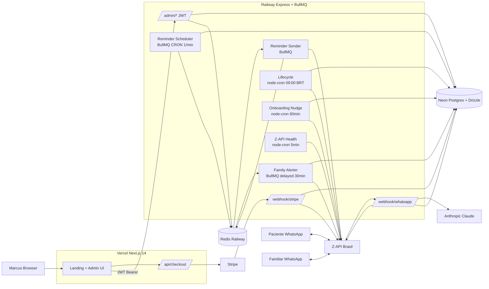
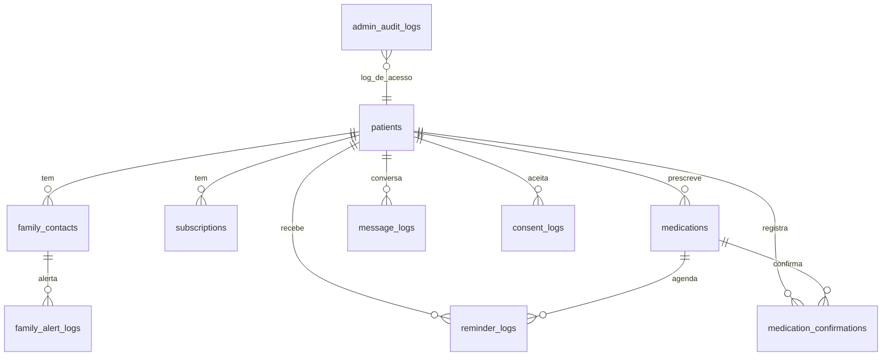

# Arquitetura — Lembrymed

**Versão:** pós-auditoria 2026-04-22
**Público-alvo:** Marcus (CEO) + devs/colaboradores técnicos

---

## Visão geral em linguagem de CEO

O Lembrymed é, na prática, **uma conversa entre 3 partes que trocam mensagens de WhatsApp**:

1. **O paciente** — fala com o bot para cadastrar remédios e depois responde "SIM" ou "NÃO" aos lembretes.
2. **O bot (Claude + lógica custom)** — entende a conversa e decide o que fazer.
3. **O familiar cadastrado** — só recebe mensagem se o paciente deixar de confirmar um remédio.

Tudo que aparece como "painel admin BIZZ.IA" (dashboard, pacientes, receita) é **leitura/manutenção** dessa conversa pelo Marcus — não há interação do paciente pela web.

## Diagrama de fluxo

---

## Trilha de dados de um paciente típico

1. **Landing → Checkout**
   - Paciente preenche nome/email/WhatsApp → clica no botão.
   - Frontend Next.js valida com Zod + exige checkbox LGPD.
   - `POST /api/checkout` (no Next.js) cria `Stripe.Checkout.Session` com metadata (nome, telefone, consent version, IP, user-agent).

2. **Pagamento → Webhook Stripe**
   - Stripe confirma → envia evento `checkout.session.completed` para `/webhook/stripe` no Railway.
   - Railway valida HMAC + dedup em Redis + upsert em `patients` + grava `consent_logs` + envia WhatsApp de boas-vindas via Z-API.

3. **Onboarding conversacional**
   - Paciente responde WhatsApp → Z-API chama `/webhook/whatsapp` com token.
   - Token validado com `timingSafeEqual` + dedup de `messageId` em Redis.
   - Claude Sonnet 4.6 conversa com o paciente para coletar medicamentos.
   - Marcadores especiais `[MEDICAMENTOS_CONFIRMADOS]`, `[FAMILIAR_CONFIRMADO:Nome:phone]`, `[ONBOARDING_COMPLETO]` sinalizam transição de estado.
   - Claude Haiku 4.5 extrai JSON estruturado da conversa para persistir em `medications`.
   - `patients.onboarding_step` avança no enum até `'active'`.

4. **Cron de lembretes (BullMQ)**
   - A cada 60 segundos, scheduler varre `medications` ativos.
   - Calcula janela T-30min, T-5min, T+5min em horário BRT.
   - Enfileira `send-reminder` com `jobId` determinístico (`reminder-<patient>-<med>-<time>-<type>-<date>`) → dedup automático.
   - Sender envia via Z-API + grava `reminder_logs`.
   - Se for T+5, agenda `family-alert` com delay de 30min.

5. **Confirmação ou silêncio**
   - Paciente responde `SIM`/`NÃO` → webhook → `handleConfirmation` grava TODOS os T+5 do último bloco de horário em `medication_confirmations`.
   - Se não responder, 30min depois `family-alerter` checa; se `confirmation_status != 'confirmed'` e há familiar cadastrado, envia alerta — **1 alerta por dia por familiar** (dedup via `family_alert_logs`).

6. **Lifecycle diário (09:00 BRT)**
   - Lembretes de renovação (30/15/3 dias) com flags `renewal_reminder_*_sent`.
   - Suspensão ao vencer.
   - Check-in para pacientes que ficaram 3+ dias sem confirmar nada.
   - Retention LGPD: anonimiza `message_logs.content > 90d`.
   - Relatório mensal de adesão no dia 1º.

7. **Renovação**
   - Stripe webhook com `metadata.type === 'renewal'` reativa assinatura + medicamentos + envia WhatsApp de confirmação.

---

## Estrutura do banco (Neon)

**Tabelas:**

- **Core do negócio:** `patients`, `family_contacts`, `subscriptions`, `medications`, `reminder_logs`, `medication_confirmations`, `message_logs`, `family_alert_logs`.
- **Sistema:** `system_config`.
- **LGPD:** `consent_logs`, `privacy_policies`, `admin_audit_logs`.

Todos os FKs importantes têm `ON DELETE CASCADE` (ou SET NULL onde faz sentido preservar), permitindo que `DELETE /admin/patients/:id` apague tudo sem violar constraint.

---

## Decisões arquiteturais importantes

### Por que não separar API e workers?
Hoje os 6 workers rodam no mesmo processo Express. **Aceito** para o volume atual (centenas de pacientes). Quando passarmos de 1000 ativos, migrar workers para service Railway separado (item 08 em RISCOS-RESIDUAIS.md). Custo: +15-20 USD/mês.

### Por que Z-API e não WhatsApp Business API oficial?
Z-API dá ativação imediata (5 minutos) e preço previsível (~R$49/mês). A BSP oficial (360dialog, Meta Cloud) exige validação de business, número verificado, templates aprovados. Para um MVP healthtech onde time-to-market importa, Z-API é o caminho. O código mantém providers alternativos (`360dialog`, `meta`, `twilio`) acionáveis via `WHATSAPP_PROVIDER` env se quisermos migrar.

### Por que Claude messages.create e não Managed Agents?
Managed Agents (Anthropic beta) foi a primeira arquitetura (v1). Migrou para `messages.create` direto na v2.x porque:
- Maior controle sobre prompt injection / custo por token
- Estado em tabela `patients` (não em sessão externa) — zero dependência de SDK beta
- Marcadores textuais (`[MEDICAMENTOS_CONFIRMADOS]`) são suficientes para o fluxo linear deste produto.

Diretório `_legacy` foi removido na Onda 3 da auditoria.

### Por que não há UI para o paciente?
**Decisão de produto deliberada** — idosos e pacientes crônicos já usam WhatsApp. Pedir para baixar um app adicionaria fricção com zero ROI. Se um dia precisarmos de UI (ex: histórico visual completo), entramos em um fluxo PWA leve, não em app nativo.

### Por que Neon em vez de Postgres hospedado normal?
Branching de banco é matador para desenvolvimento seguro — cada PR de schema pode rodar em branch Neon isolada sem cópia de dados. Serverless também escala a zero em horários vazios. Contra: cold-start de ~100-400ms em queries novas.

---

## Limitações conhecidas

- **Canal único (WhatsApp):** se Z-API cair, os lembretes param. Mitigação: worker `zapi-health` + alerta admin. Plano B (SMS/email) pendente de decisão.
- **Single-admin:** um único Marcus logado; sem multi-tenant. Aceitável para o estágio atual.
- **Idempotência parcial do scheduler:** `jobId` determinístico cobre 99% dos casos; se BullMQ/Redis reiniciar, pode haver re-envio marginal.
- **Conversa em texto no `message_logs`:** mantida 90 dias, depois anonimizada. Se Neon for hackeado nessa janela, conversa é leakable. Mitigação futura: criptografia aplicação-level.

Para decisões abertas e custos, ver [`docs/ROADMAP.md`](ROADMAP.md) e `AUDIT/RISCOS-RESIDUAIS.md`.
