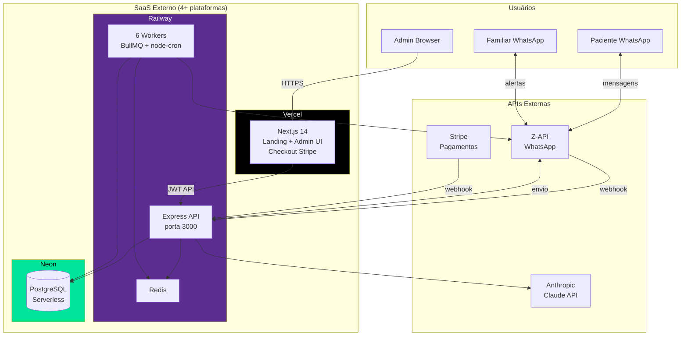
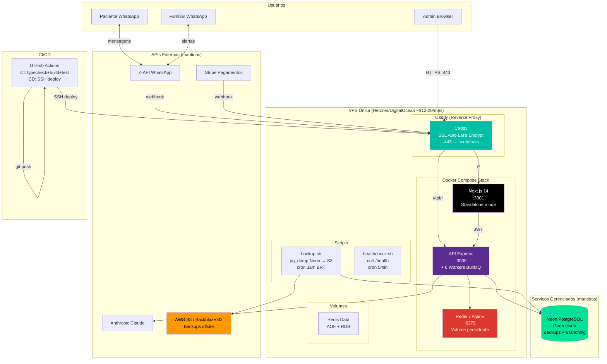
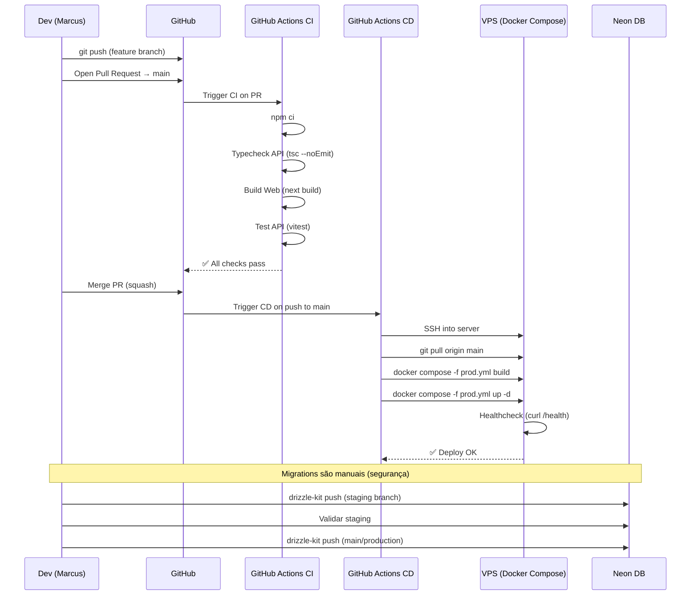
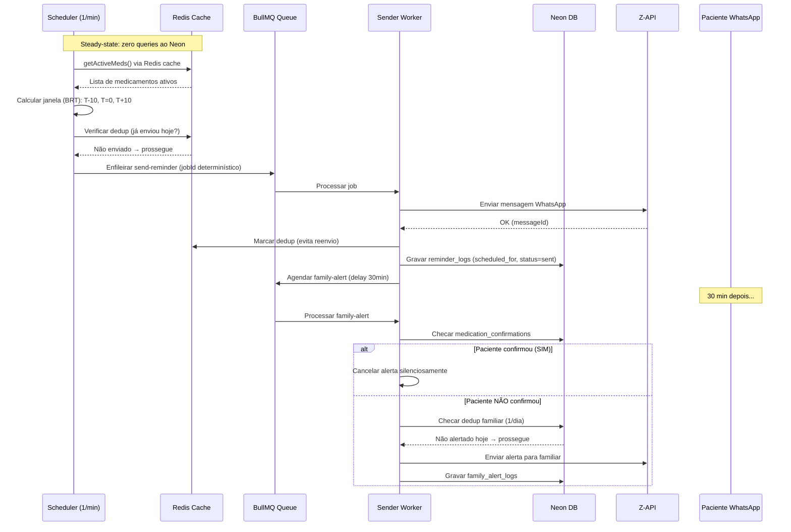
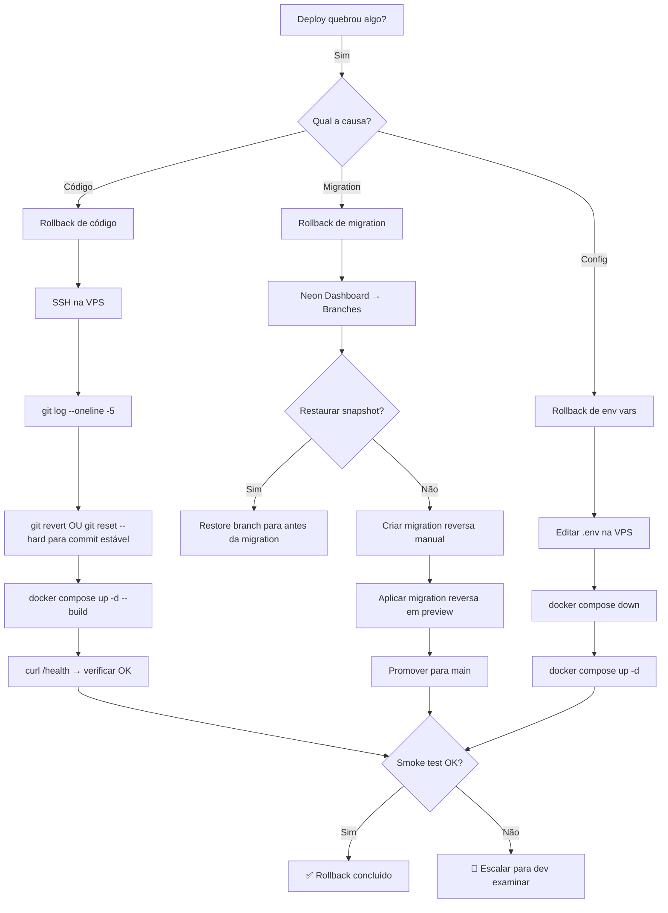

# ARQUITETURA CENTRALIZADA — PROPOSTA LEMBRYMED

**Data:** 07/07/2026
**Referência:** Cenário C (Híbrido Estratégico) da MATRIZ_CENTRALIZACAO_CUSTOS.md
**Objetivo:** Propor uma arquitetura de produção mais enxuta, com diagramas Mermaid.

---

## VISÃO GERAL

A arquitetura proposta centraliza toda a computação (API, workers, frontend, Redis) em uma única VPS com Docker Compose, mantendo serviços gerenciados apenas onde são insubstituíveis: banco de dados (Neon), WhatsApp (Z-API), pagamentos (Stripe) e IA (Anthropic Claude).

**Princípios:**
1. Uma VPS = um lugar para gerenciar
2. Docker Compose = infraestrutura como código
3. GitHub Actions = CI/CD automatizado
4. Volumes persistentes = dados não desaparecem em redeploy
5. Caddy = SSL automático sem configuração manual
6. Neon gerenciado = paz de espírito para dados de saúde

---

## 1. ARQUITETURA ATUAL ESTIMADA



**Problemas desta arquitetura:**
- 4 plataformas para gerenciar (Vercel, Railway, Neon, Z-API)
- Comunicação entre Vercel e Railway adiciona latência (internet pública)
- Custos imprevisíveis (Railway cobra por uso)
- Deploy em 2 lugares diferentes
- Sem ambiente staging isolado
- Logs distribuídos em 3 lugares diferentes

---

## 2. ARQUITETURA CENTRALIZADA PROPOSTA (Cenário C — Híbrido)



**Benefícios:**
- 1 lugar para gerenciar (VPS) em vez de 3 (Railway + Vercel + Neon)
- Comunicação interna via rede Docker (latência zero entre API e Web)
- SSL automático via Caddy (Let's Encrypt)
- Custo previsível (~$12-20/mês VPS + $19 Neon + $10 Z-API = ~$41-49)
- Deploy unificado via GitHub Actions
- Backups automatizados com offsite (S3)
- Healthcheck e monitoramento centralizados

---

## 3. FLUXO DE DEPLOY VIA GITHUB



---

## 4. FLUXO DE DADOS (LEMBRETE)



---

## 5. FLUXO DE ROLLBACK



---

## 6. FLUXO DE BACKUP

```mermaid
flowchart TD
    subgraph "Backup Automático (cron 3:00 AM BRT)"
        A[Cron dispara backup.sh]
        A --> B[pg_dump Neon → /data/backups/lembrymed_TIMESTAMP.dump]
        B --> C{pg_dump OK?}
        C -->|Sim| D[Compactar .dump (gzip)]
        C -->|Não| E[Notificar ADMIN_WHATSAPP<br/>'🚨 Backup falhou']
        D --> F[Sincronizar com S3/B2 via rclone]
        F --> G{Limpeza: backups > 30 dias?}
        G -->|Sim| H[Deletar backups antigos locais]
        G -->|Não| I[Manter]
        H --> J[✅ Backup concluído. Log em /var/log/backup.log]
        I --> J
    end

    subgraph "Teste de Restore (mensal, manual)"
        K[1º dia do mês: testar restore]
        K --> L[Baixar último .dump do S3]
        L --> M[pg_restore em banco staging Neon]
        M --> N[Rodar smoke test no staging]
        N --> O{Staging funciona?}
        O -->|Sim| P[✅ Backup validado]
        O -->|Não| Q[🚨 Investigar backup corrompido]
    end
```

---

## COMPONENTES DA ARQUITETURA PROPOSTA

### Aplicação Frontend (Next.js)
- **Container:** `node:20-slim` + Next.js standalone build
- **Porta:** 3001 (interna)
- **Build:** `next build` (SSG landing + admin SPA)
- **Dependências:** Stripe SDK (checkout), framer-motion
- **Conexão externa:** → API interna (`http://api:3000`)

### Aplicação Backend (Express)
- **Container:** `node:20-slim` + esbuild bundle
- **Porta:** 3000 (interna)
- **Workers:** 6 workers BullMQ + node-cron no mesmo container (aceitável para volume atual)
- **Dependências:** ioredis, bullmq, @neondatabase/serverless, stripe, @anthropic-ai/sdk, bcryptjs, jsonwebtoken, zod, winston
- **Conexão externa:** → Neon (DATABASE_URL), Redis (redis:6379), Z-API, Stripe, Anthropic

### Redis
- **Container:** `redis:7-alpine`
- **Porta:** 6379 (interna, sem exposição externa)
- **Persistência:** AOF + RDB em volume Docker
- **Uso:** BullMQ backend, cache de saúde, dedup de webhook, med-schedule-cache

### Reverse Proxy (Caddy)
- **Container:** `caddy:2-alpine`
- **Portas:** 80 → 443 (SSL automático)
- **Roteamento:**
  - `/api/*` → API (3000)
  - `/webhook/*` → API (3000)
  - `/health` → API (3000)
  - `/metrics` → API (3000)
  - `/*` → Web (3001)

### Banco de Dados (Neon — gerenciado)
- **Provider:** Neon PostgreSQL Serverless
- **Plano:** Launch ($19/mês, 300 CU-horas)
- **Conexão:** DATABASE_URL (pooled, HTTP) via @neondatabase/serverless
- **Backup:** pg_dump agendado → S3

### CI/CD (GitHub Actions)
- **CI:** typecheck + build + test em cada PR
- **CD:** SSH deploy em push para main
- **Secrets:** GitHub Secrets (VPS_HOST, VPS_USER, VPS_SSH_KEY)

### Monitoramento
- **Healthcheck:** `GET /health` (Redis + DB status)
- **Métricas:** `GET /metrics` (filas, entregas, uptime)
- **Alertas:** Worker `zapi-health` (Z-API status via WhatsApp)
- **Logs:** Winston → stdout → Docker json-file driver

### Domínios
- `lembrymed.com.br` → Landing + Admin (Caddy → web:3001)
- `api.lembrymed.com.br` → API (Caddy → api:3000) — opcional, pode usar path-based
- SSL: Let's Encrypt via Caddy (renovação automática)

---

## ESTIMATIVA DE RECURSOS DA VPS

| Serviço | RAM | CPU | Disco |
|---------|-----|-----|-------|
| Caddy | 50MB | 0.1 | — |
| API + Workers | 256-512MB | 0.5-1.0 | — |
| Web (Next.js) | 128-256MB | 0.3-0.5 | — |
| Redis | 128-256MB | 0.2 | 5GB (volume) |
| Sistema + folga | 512MB | — | 10GB |
| **Total recomendado** | **2-4GB** | **2 vCPU** | **40-80GB SSD** |

---

## PRÓXIMOS PASSOS

1. Criar `docker-compose.yml` (dev local com Postgres + Redis)
2. Criar `docker-compose.prod.yml` (produção na VPS)
3. Criar `Caddyfile`
4. Criar Dockerfile para web (Next.js standalone)
5. Criar `.github/workflows/deploy.yml`
6. Criar scripts (backup, healthcheck, restore)
7. Testar stack completa localmente
8. Provisionar VPS e testar staging
9. Migrar produção
